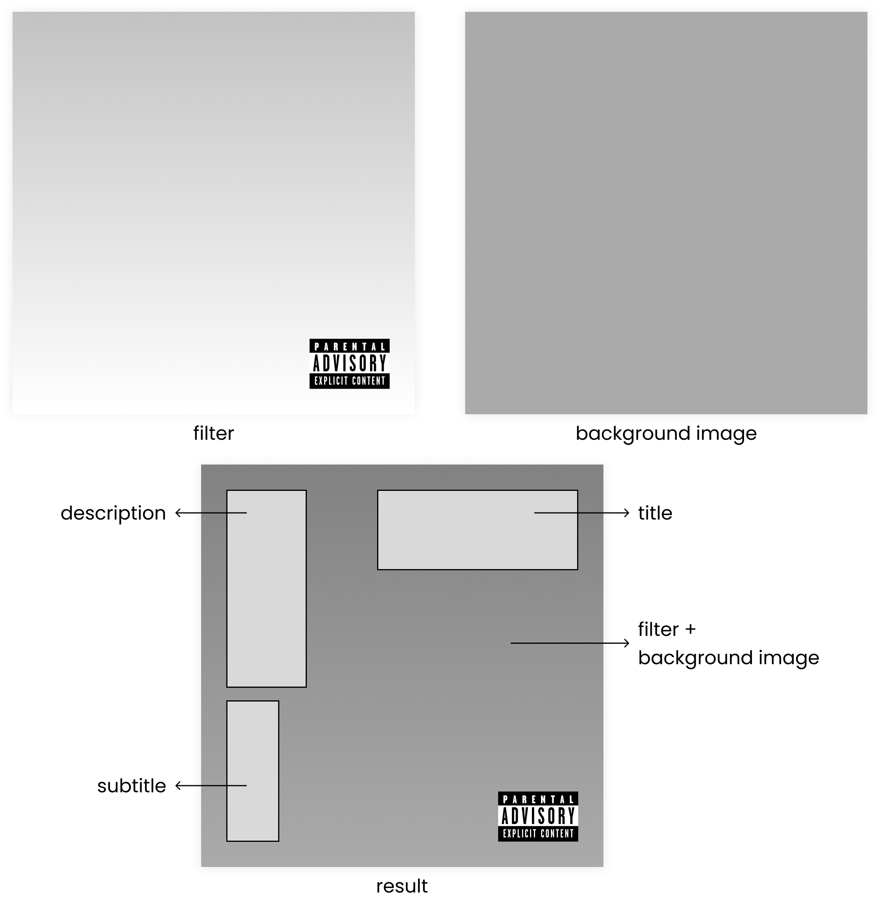

# Album cover - CLI

## **About**

I created this project to automate the process of creating album covers. I'm not a musician, but I love music and I love programmig. So I decided to create covers for my projects.

<div align="center">
  
</div>

## **The structure**

The following figure shows how the data passed in command line is placed in the final image.

<div align="center">
  
</div>

## **How to use**

In the folder of the CLI, try in your terminal:

```bash
$ python album_cover_cli -h
```

and also run:

```bash
$ python album_cover_cli cover -h
```

the expected exit is:

```
usage: album-cover-cli [options] cover [-h] -t TITLE [-s SUBTITLE] [-d DESCRIPTION] -ip IMAGE_PATH

options:
  -h, --help            show this help message and exit
  -t TITLE, --title TITLE
                        album name
  -s SUBTITLE, --subtitle SUBTITLE
                        album subtitle
  -d DESCRIPTION, --description DESCRIPTION
                        album description
  -ip IMAGE_PATH, --image-path IMAGE_PATH
                        album image path
```
